---
## Author
author:
  name: Поляков Сергей Александрович
  email: 1032250311@pfur.ru
  affiliation:
    - name: Российский университет дружбы народов
      country: Российская Федерация
      postal-code: 117198
      city: Москва
      address: ул. Миклухо-Маклая, д. 6

## Title
subtitle: "Архитектура компьютеров"
title: "Отчёт по лабораторной работе 5"
license: "CC BY"
---

# Цель работы

Целью работы является приобретение практических навыков работы в Midnight Commander. 
Освоение инструкций языка ассемблера mov и int.

# Выполнение лабораторной работы

1. Я открыл Midnight Commander и перешел в каталог ~/work/arch-pc. Создал новый каталог под названием lab05.

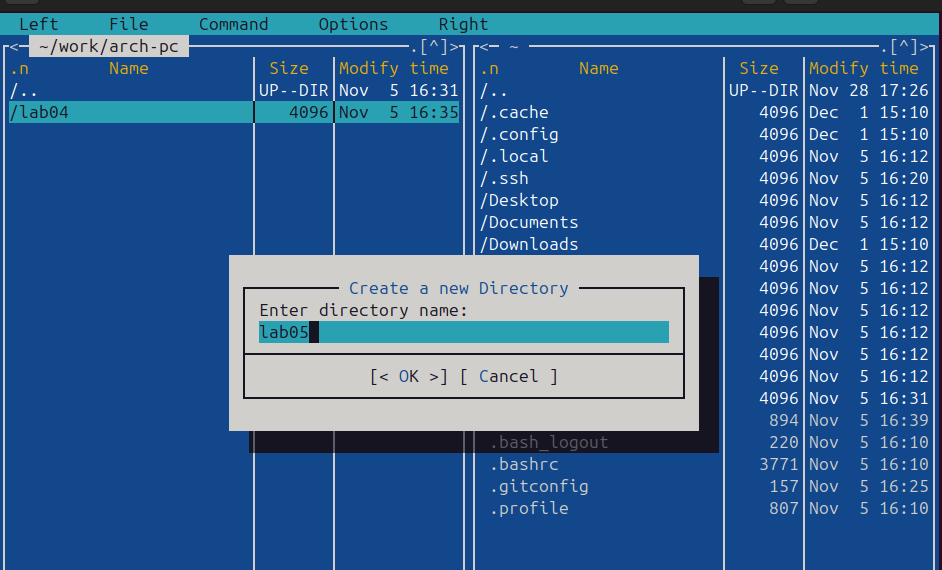{ #fig:001 width=70%, height=70% }

2. Внутри каталога lab05 я создал файл lab05-1.asm. Затем я открыл этот файл для редактирования и начал писать код.

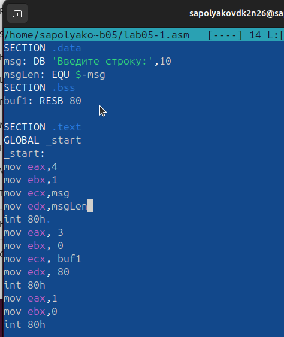{ #fig:002 width=70%, height=70% }

3. Я также открыл файл lab05-1.asm для просмотра и проверил, что код был написан правильно.

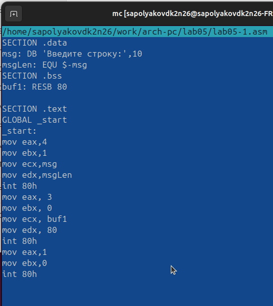{ #fig:003 width=70%, height=70% }

4. После того, как я получил исполняемый файл из кода, я проверил его работу, чтобы убедиться, что все функционирует должным образом.

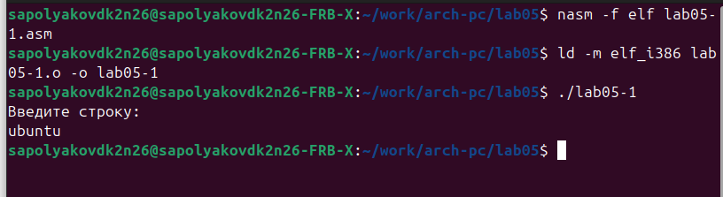{ #fig:004 width=70%, height=70% }

5. Я скачал файл in_out.asm и добавил его в рабочий каталог. Затем я скопировал содержимое файла lab05-1.asm в новый файл под названием lab05-2.asm.

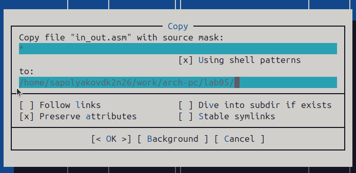{ #fig:005 width=70%, height=70% }

6. В файле lab05-2.asm я написал код программы. После этого я скомпилировал программу и проверил ее запуск.

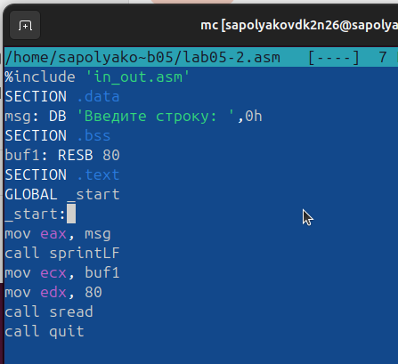{ #fig:006 width=70%, height=70% }

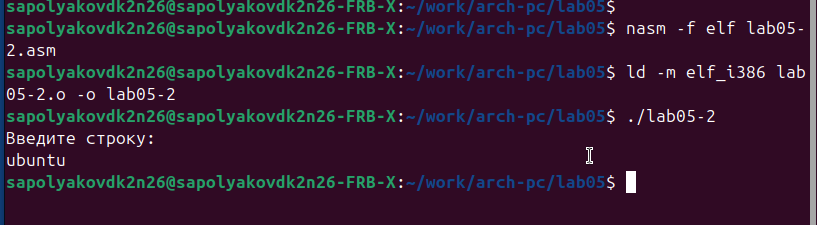{ #fig:007 width=70%, height=70% }

7. Внутри файла lab05-2.asm я заменил подпрограмму sprintLF на sprint. Затем я пересобрал исполняемый файл. Теперь при выводе строки нет перехода на следующую строку.

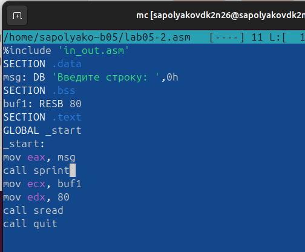{ #fig:008 width=70%, height=70% }

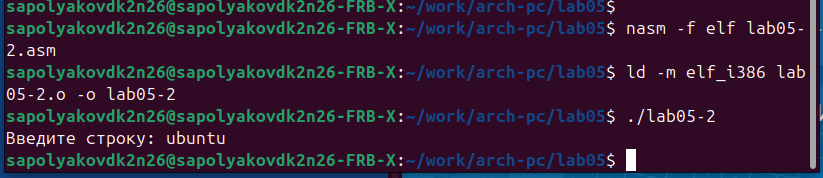{ #fig:009 width=70%, height=70% }

8. Я скопировал программу lab05-1.asm и изменил код так, чтобы сначала выводилось приглашение "Введите строку:", затем пользователь вводил строку с клавиатуры, и введенная строка выводилась на экран.

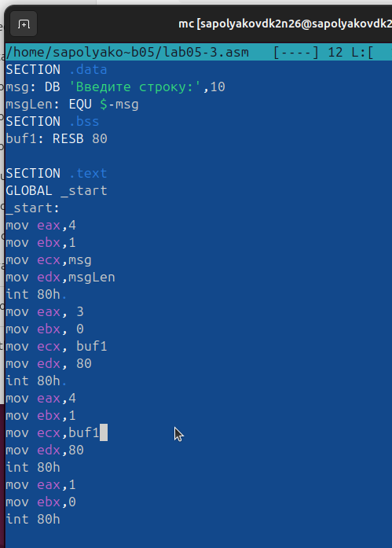{ #fig:010 width=70%, height=70% }

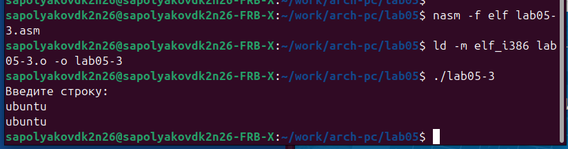{ #fig:011 width=70%, height=70% }

9. Затем я скопировал программу lab05-2.asm и выполнил аналогичные действия, описанные выше, но теперь использовал возможности из файла in_out.asm.

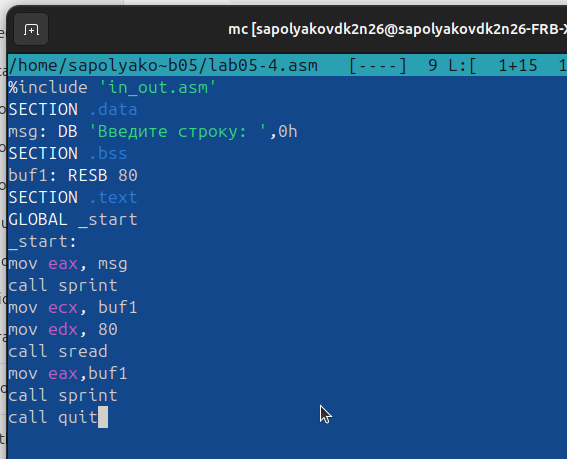{ #fig:012 width=70%, height=70% }

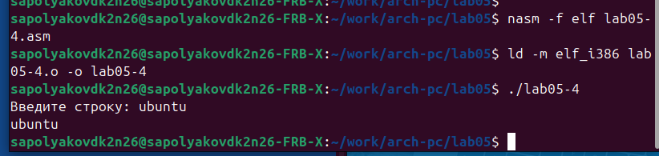{ #fig:013 width=70%, height=70% }

# Выводы

Научились писать базовые ассемблерные программы. Освоили ассемблерные инструкции mov и int.
