---
## Author
author:
  name: Поляков Сергей Александрович
  email: 1032250311@pfur.ru
  affiliation:
    - name: Российский университет дружбы народов
      country: Российская Федерация
      postal-code: 117198
      city: Москва
      address: ул. Миклухо-Маклая, д. 6

## Title
subtitle: "Архитектура компьютеров"
title: "Отчёт по лабораторной работе 6"
license: "CC BY"
---

# Цель работы

Целью работы является освоение арифметических инструкций языка ассемблера NASM.

# Выполнение лабораторной работы

1. Создал каталог для программам лабораторной работы № 6, перешел в него и создал файл lab6-1.asm. 

2. Рассмотрим примеры программ вывода символьных и численных значений. 
Программы будут выводить значения, записанные в регистр eax.

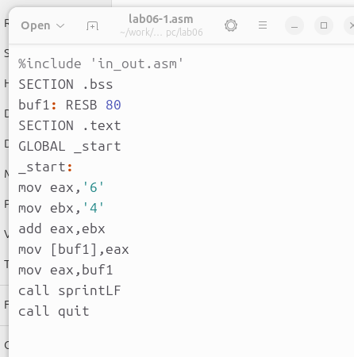{ #fig:001 width=70%, height=70% }

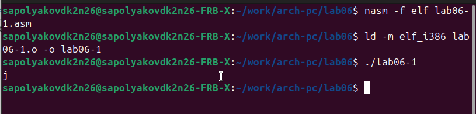{ #fig:002 width=70%, height=70% }

3. Далее изменяю текст программы и вместо символов, запишем в регистры числа. 

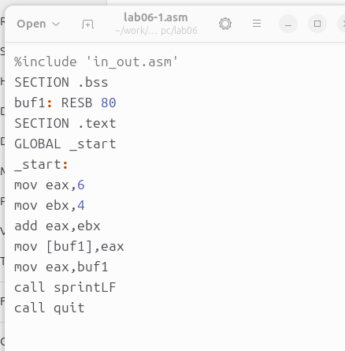{ #fig:003 width=70%, height=70% }

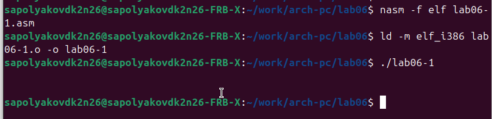{ #fig:004 width=70%, height=70% }

Никакой символ не виден, но он есть. Это возврат каретки LF.

4. Как отмечалось выше, для работы с числами в файле in_out.asm реализованы 
подпрограммы для преобразования ASCII символов в числа и обратно. 
Преобразовал текст программы с использованием этих функций.

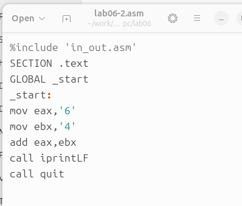{ #fig:005 width=70%, height=70% }

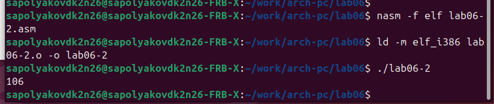{ #fig:006 width=70%, height=70% }

В результате работы программы мы получим число 106. В данном случае, как и в первом, 
команда add складывает коды символов ‘6’ и ‘4’ (54+52=106). 
Однако, в отличии от прошлой программы, функция iprintLF позволяет вывести число, 
а не символ, кодом которого является это число.

5. Аналогично предыдущему примеру изменим символы на числа.

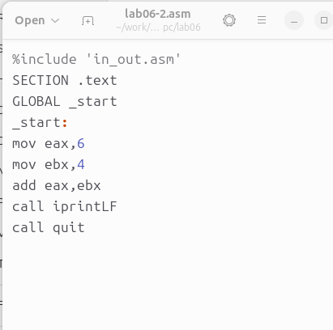{ #fig:007 width=70%, height=70% }

Функция iprintLF позволяет вывести число и операндами были числа (а не коды символов).
Поэтому получаем число 10.

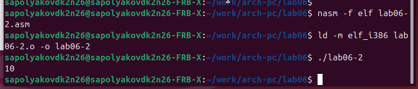{ #fig:008 width=70%, height=70% }

Заменил функцию iprintLF на iprint. Вывод отличается что нет переноса строки.

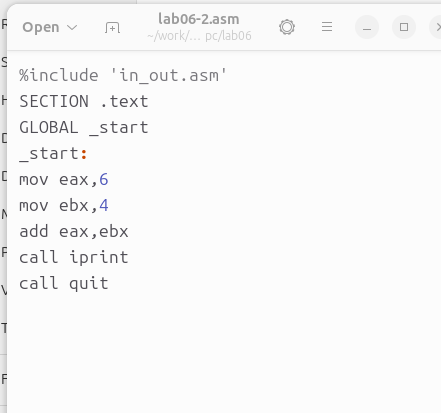{ #fig:009 width=70%, height=70% }

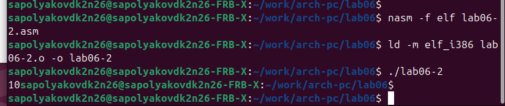{ #fig:010 width=70%, height=70% }

6. В качестве примера выполнения арифметических операций в NASM приведем 
программу вычисления арифметического выражения 
$$f(x) = (5 * 2 + 3)/3$$.

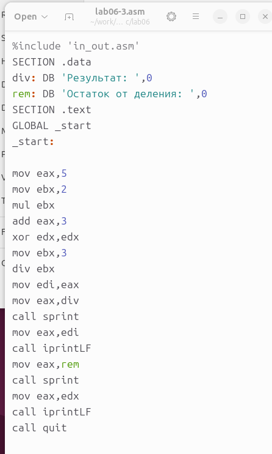{ #fig:011 width=70%, height=70% }

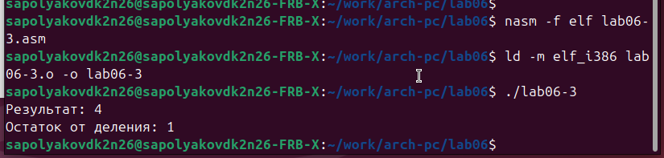{ #fig:012 width=70%, height=70% }

Изменил текст программы для вычисления выражения 
$$f(x) = (4 * 6 + 2)/5$$. 
Создал исполняемый файл и проверил его работу.

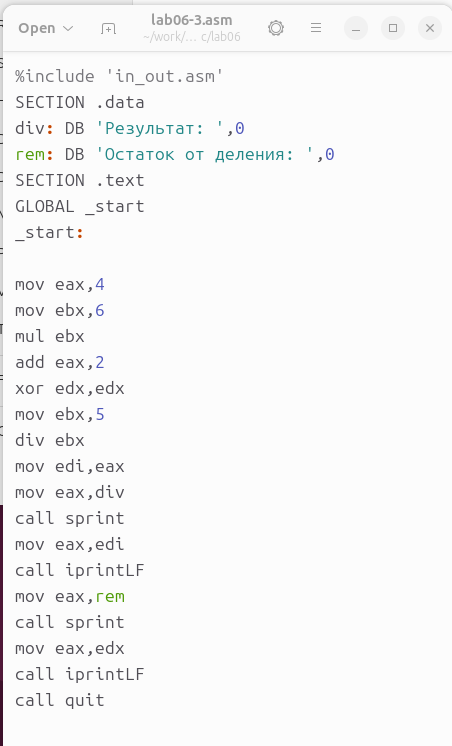{ #fig:013 width=70%, height=70% }

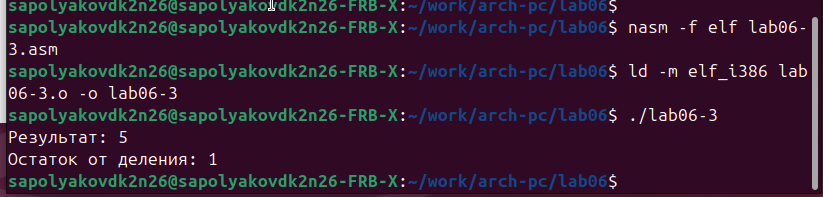{ #fig:014 width=70%, height=70% }

7. В качестве другого примера рассмотрим программу вычисления варианта задания по 
номеру студенческого билета.

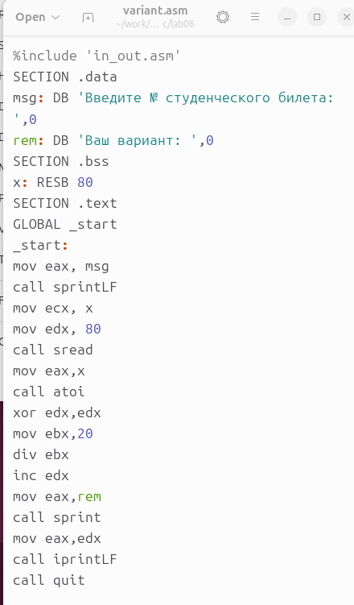{ #fig:015 width=70%, height=70% }

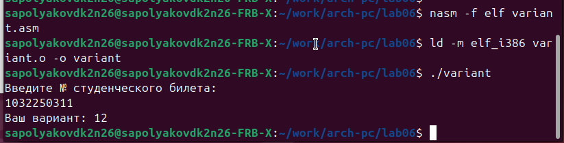{ #fig:016 width=70%, height=70% }

ответы на вопросы

1. Какие строки листинга отвечают за вывод на экран сообщения ‘Ваш вариант:’?

Значение переменной с фразой 'Ваш вариант:' перекладывается в регистр eax с помощью строки mov eax, rem.
Вызывается подпрограмма sprint для вывода строки.

2. Для чего используется следующие инструкции?

mov ecx, x 
mov edx, 80 
call sread

Инструкция mov ecx, x перемещает значение переменной X в регистр ecx.
 
Инструкция mov edx, 80 устанавливает значение 80 в регистр edx.

Инструкция call sread вызывает подпрограмму для чтения значения с консоли.

3. Для чего используется инструкция “call atoi”?

Инструкция call atoi вызывает подпрограмму, которая преобразует введенные символы в числовой формат.

4. Какие строки листинга отвечают за вычисления варианта?

Инструкция xor edx, edx обнуляет регистр edx.

Инструкция mov ebx, 20 устанавливает значение 20 в регистр ebx.

Инструкция div ebx выполняет деление номера студенческого билета на 20.

Инструкция inc edx увеличивает значение регистра edx на 1.

5. В какой регистр записывается остаток от деления при выполнении инструкции “div ebx”?

Остаток от деления записывается в регистр edx.

6. Для чего используется инструкция “inc edx”?

Инструкция inc edx используется для увеличения значения 
регистра edx на 1. В данном случае, она используется для 
выполнения формулы вычисления варианта, 
где требуется добавить 1 к остатку от деления.

7. Какие строки листинга отвечают за вывод на экран результата вычислений? 

Результат вычислений перекладывается в регистр eax с помощью строки mov eax, edx.
Вызывается подпрограмма iprintLF для вывода результата на экран.

8. Написать программу вычисления выражения y = f(x). Программа должна выводить выражение 
для вычисления, выводить запрос на ввод значения x, 
вычислять заданное выражение в зависимости от введенного x, выводить результат вычислений. 
Вид функции f(x) выбрать из таблицы 6.3 вариантов заданий в соответствии с номером 
полученным при выполнении лабораторной работы. 
Создайте исполняемый файл и проверьте его работу для значений x1 и x2 из 6.3.

Получили вариант 19 - $$(8x - 6)/2$$  для $$x=1, x=5$$

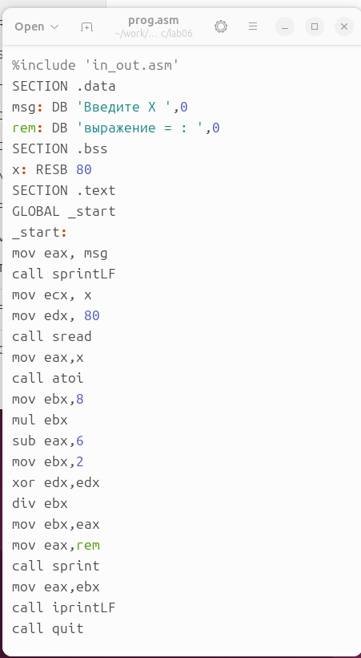{ #fig:017 width=70%, height=70% }

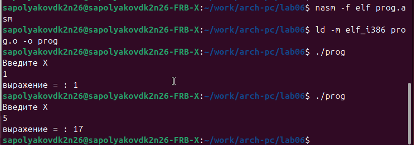{ #fig:018 width=70%, height=70% }

# Выводы

Изучили работу с арифметическими операциями.
